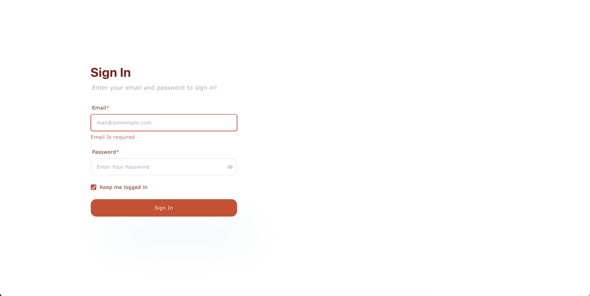
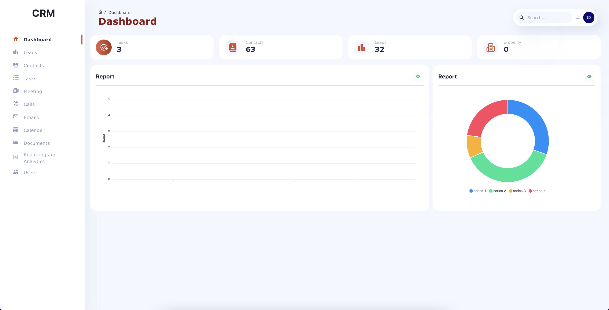
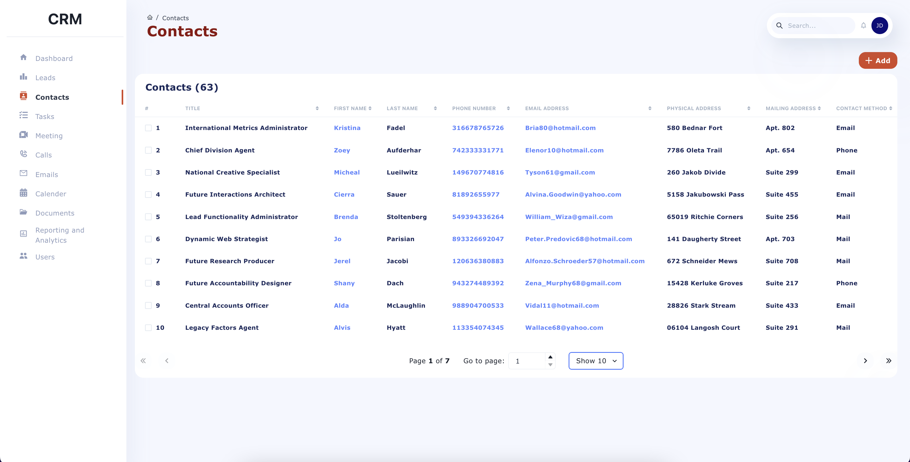
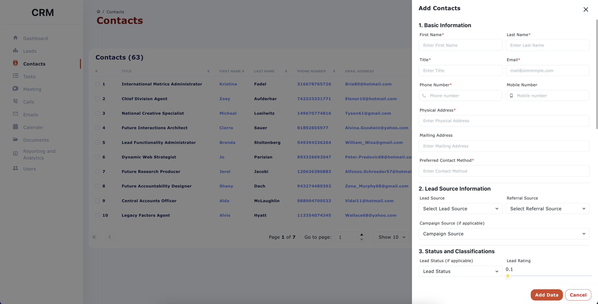
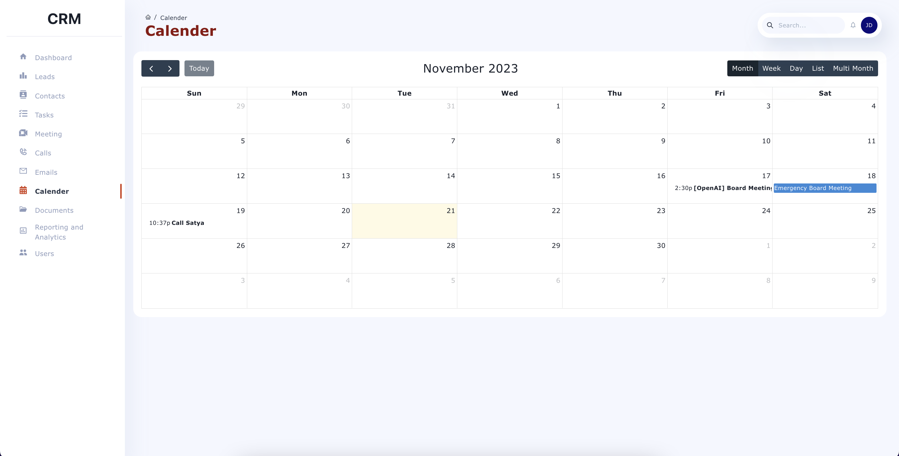
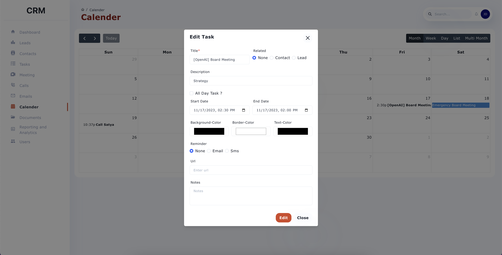
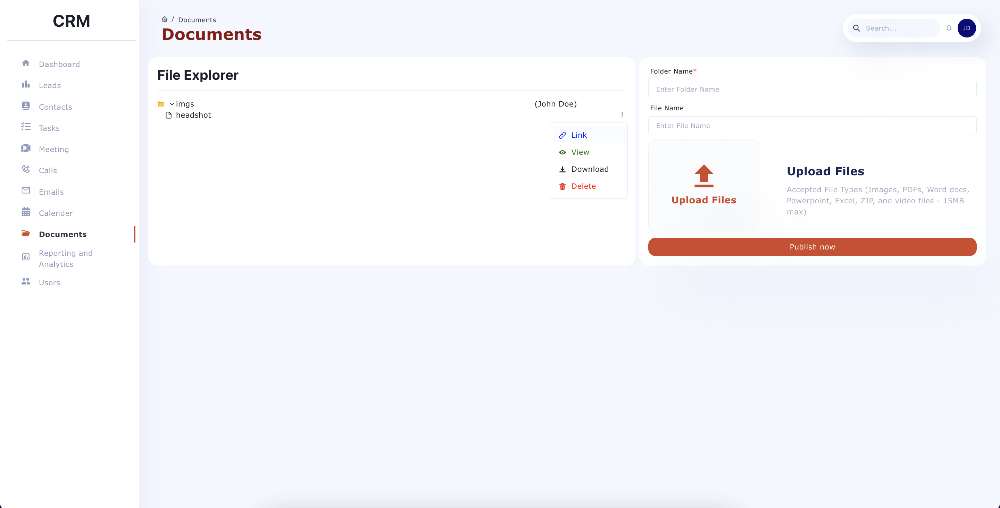

# Overview of My CRM Project

This project is a Customer Relationship Management (CRM) system, developed to manage various aspects of customer interactions and internal tasks. Built using React for the frontend and an Express backend, the system interacts with a MongoDB database, ensuring efficient handling of data and user requests.

## Personal Objectives

**Familiarize with MongoDB:** Gain practical experience in using MongoDB for database operations.
**Advance Server-Side Programming Skills:** Develop expertise in implementing more complex server functionalities.
**Advance Server-Side Programming Skills:** Enhance UI Development: Build a user interface that is both functional and visually appealing, leveraging advanced UI design principles.

## Project Demonstration

I've prepared a demonstration for those interested in witnessing the CRM in action:

- **Video Demo:** [Watch the Video Demo](https://youtu.be/hs5Pfrr3fOM?si=60yPNClNSrpSBFu1)
- **AWS Deployment:** [Explore the CRM Demo on AWS](https://main.d3g16lag4ur1pf.amplifyapp.com/auth/sign-in)

## Technical Design

### Frontend (React)

- **Dashboard Pages**: Serve as the central hub, displaying summaries from various sections like contacts, tasks, and leads.
- **Contact Management**: Interfaces for managing contact information, including add, view, and edit functionalities.
- **Task Management**: Allows users to manage tasks, link them to contacts or leads.
- **Other Features**: Meeting management, call logs, email history, document management, and more.

### Backend (Express with MongoDB)
The backend handles data processing, API endpoints, and database interactions.

- **API Routes**: Defined for CRUD operations on various entities like contacts, tasks, meetings.
- **Controllers**: Contain logic for handling requests and interacting with the MongoDB database.
- **Database Interaction**: Mongoose models are used for interacting with MongoDB collections.

## Data Flow Example
1. **User Interaction**: Submission of the contact form in the frontend.
2. **API Call**: `postApi` from `api.js` sends data to the backend.
3. **Backend Processing**: Route in `_routes.js` calls the appropriate function in `contact.js`.
4. **Database Operation**: Function in `contact.js` updates the MongoDB database.
5. **Response Handling**: Server response is sent back to the frontend.

  

## Summary
- **Frontend**: Focused on user experience, built with React.
- **Backend**: Manages data and business logic, developed using Express and MongoDB.
- **Security**: JWT tokens for authorization and secure data access.

## User Interface
### 1. Login

  

### 2. Home Page

  

### 3. Contacts Page

  

### 3.a Add Contact

  

### 4. Calendar

  

### 4.a Calendar

  

### 5. Documents

  

## React.js Project Installation Guide

### Getting Started

This guide details the steps to install and run the React.js project from the GitHub repository: real-estate-frontend.

### Prerequisites

Ensure these tools are installed:

1. **Node.js and npm**:
   - **Download Node.js**: Visit [Node.js](https://nodejs.org/) and download the LTS version.
   - **Install Node.js**: Run the downloaded installer and follow the prompts. Ensure npm is included.
   - **Verify Installation**: Open a terminal and run `node -v` and `npm -v` to check the installation.

2. **MongoDB Compass** (Optional):
   - Download MongoDB Compass or create an account on MongoDB Atlas.

### Frontend Installation

1. **Download Project**:
   - Download the project ZIP from GitHub or another source.

2. **Extract ZIP**:
   - Extract the ZIP to a preferred directory.

3. **Open Terminal**:
   - Open a terminal or command prompt.

4. **Navigate to Project**:
   - Use `cd path/to/project-directory`.

5. **Install Dependencies**:
   - In the project directory, run `npm install` or `yarn install`.

6. **Start Development Server**:
   - Run `npm start` or `yarn start`.

7. **Change baseUrl**:
   - In the project directory, open `constant.js` and change `baseUrl` to your backend server URL (e.g., `http://127.0.0.1:5001/`).

8. **Access Application**:
   - Open a browser and navigate to `http://localhost:3000`.

### Backend Installation

1. **Download Backend Project**:
   - Download the backend project ZIP from a source.

2. **Extract and Navigate**:
   - Follow steps 2 and 4 as above for the backend project.

3. **Install Dependencies**:
   - In the backend project directory, run `npm install` or `yarn install`.

4. **Configure Database**:
   - Create a `.env` file in the project directory.
   - Add `DB_URL = [your MongoDB URL]` and `DB = [your MongoDB Database Name]`.

5. **Start Server**:
   - Run `npm start`.

6. **Open Application**:
   - Navigate to `http://localhost:3000`.

### Default Admin Access

(not functional on AWS deployment)
- **Email**: admin@gmail.com
- **Password**: admin123

### Support

Contact us for any setup difficulties or questions.
