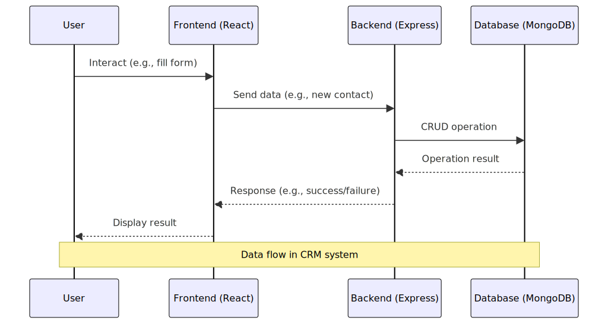

# Overview

Welcome to the Customer Relationship Management (CRM) project! This system is designed to efficiently manage various aspects of customer interactions and internal tasks. It utilizes React for the frontend and an Express backend, interacting seamlessly with a MongoDB database. Explore the details of this project's objectives, demonstrations, technical design, and user interface in the sections below.

## Table of Contents
   - [Personal Objectives](#personal-objectives)
   - [Project Demonstration](#project-demonstration)
   - [Technical Design](#technical-design)
   - [User Interface (screenshots)](#user-interface)
   - [Project Installation Guide](#project-installation-guide)

## Personal Objectives

## Personal Objectives

**Deepening MongoDB Expertise:** The primary aim of this project for me is to gain hands-on experience and deepen understanding of MongoDB. This involved learning database operations, exploring advanced features, and integrating MongoDB  with the backend.

**Enhancing Server-Side Programming Capabilities:** Another focus of mine with this project is improving my server-side programming skills using Express.js. This included developing complex server functionalities, improving API design, and optimizing server performance.

**Learning UI Libraries:** I tried as best I could to use Chakra-UI and Material-UI whenever possible.

## Project Demonstration

I've prepared a demonstration for those interested in witnessing the CRM in action:

- **Video Demo:** [Watch the Video Demo](https://youtu.be/hs5Pfrr3fOM?si=60yPNClNSrpSBFu1)
- **AWS Deployment:** [Explore the CRM Demo on AWS](https://main.d3g16lag4ur1pf.amplifyapp.com/auth/sign-in)

## Technical Design

### Frontend (React)

- **Dashboard Pages**: Serve as the central hub, displaying summaries from various sections like contacts, tasks, and leads.
- **Contact Management**: Interfaces for managing contact information, including add, view, and edit functionalities.
- **Task Management**: Allows users to manage tasks, link them to contacts or leads.
- **Other Features**: Meeting management, call logs, email history, document management, and more.

### Backend (Express with MongoDB)
The backend handles data processing, API endpoints, and database interactions.

- **API Routes**: Defined for CRUD operations on various entities like contacts, tasks, meetings.
- **Controllers**: Contain logic for handling requests and interacting with the MongoDB database.
- **Database Interaction**: Mongoose models are used for interacting with MongoDB collections.

Data Flow Example
1. **User Interaction**: Submission of the contact form in the frontend.
2. **API Call**: `postApi` from `api.js` sends data to the backend.
3. **Backend Processing**: Route in `_routes.js` calls the appropriate function in `contact.js`.
4. **Database Operation**: Function in `contact.js` updates the MongoDB database.
5. **Response Handling**: Server response is sent back to the frontend.

  

### Database (MongoDB)

#### Overview

Locally, I hosted the CRM's database on MongoDB Atlas on M0 Sandbox tier

#### Collections

The database comprises several collections, each tailored to a specific aspect of the CRM system:

1. **Contacts:** Stores customer contact information.
2. **Documents:** Contains document data related to customers and transactions.
3. **Email Histories:** Tracks the history of emails sent and received.
4. **Leads:** Manages potential customer or client information.
5. **Meeting Histories:** Records details of past meetings.
6. **Phone Calls:** Logs phone call interactions.
7. **Properties:** Details properties associated with clients or leads.
8. **Tasks:** Manages tasks and assignments within the CRM.
9. **Text Messages:** Stores records of text message communications.
10. **Users:** Handles user account information and credentials.

#### Schema Overview

- **User-Centric Design:** The database schema is centered around the `USER` entity, with critical user attributes like username, role, and activity (e.g., `emailsent`). This design enables tracking and managing user-specific activities across various entities such as contacts, leads, and email histories.

- **Activity Tracking:** Entities like `CONTACT`, `LEAD`, and `EMAIL-HISTORY` are structured to capture detailed information pertinent to CRM activities. For example, `CONTACT` includes personal information, `LEAD` encompasses lead-specific details, and `EMAIL-HISTORY` records comprehensive email interaction data.

Pictured below is an example of how the lead, contact, email, and user schema's relate. Many fields are not visualized to reduce space.

  

## Summary
- **Frontend**: Focused on user experience, built with React.
- **Backend**: Manages data and business logic, developed using Express and MongoDB.
- **Security**: JWT tokens for authorization and secure data access.

## User Interface
### 1. Login

  

### 2. Home Page

  

### 3. Contacts Page

  

### 3.a Add Contact

  

### 4. Calendar

  

### 4.a Calendar

  

### 5. Documents

  

## Installation Guide

### Prerequisites

Ensure these tools are installed:

1. **Node.js and npm**:
   - **Download Node.js**: Visit [Node.js](https://nodejs.org/) and download the LTS version.
   - **Install Node.js**: Run the downloaded installer and follow the prompts. Ensure npm is included.
   - **Verify Installation**: Open a terminal and run `node -v` and `npm -v` to check the installation.

2. **MongoDB Compass** (Optional):
   - Download MongoDB Compass or create an account on MongoDB Atlas.

### Frontend Installation

1. **Download Project**:
   - Download the project ZIP from GitHub or another source.

2. **Extract ZIP**:
   - Extract the ZIP to a preferred directory.

3. **Open Terminal**:
   - Open a terminal or command prompt.

4. **Navigate to Project**:
   - Use `cd path/to/project-directory`.

5. **Install Dependencies**:
   - In the project directory, run `npm install` or `yarn install`.

6. **Start Development Server**:
   - Run `npm start` or `yarn start`.

7. **Change baseUrl**:
   - In the project directory, open `constant.js` and change `baseUrl` to your backend server URL (e.g., `http://127.0.0.1:5001/`).

8. **Access Application**:
   - Open a browser and navigate to `http://localhost:3000`.

### Backend Installation

1. **Download Backend Project**:
   - Download the backend project ZIP from a source.

2. **Extract and Navigate**:
   - Follow steps 2 and 4 as above for the backend project.

3. **Install Dependencies**:
   - In the backend project directory, run `npm install` or `yarn install`.

4. **Configure Database**:
   - Create a `.env` file in the project directory.
   - Add `DB_URL = [your MongoDB URL]` and `DB = [your MongoDB Database Name]`.

5. **Start Server**:
   - Run `npm start`.

6. **Open Application**:
   - Navigate to `http://localhost:3000`.

### Default Admin Access

(not functional on AWS deployment)
- **Email**: admin@gmail.com
- **Password**: admin123
